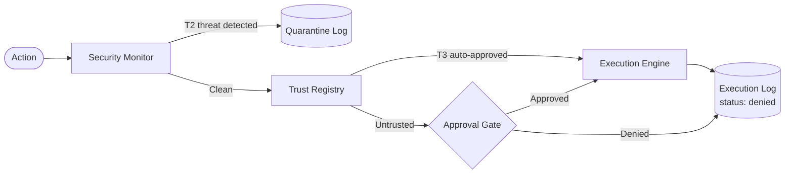

# NEXUS Base V1

[](https://github.com/masongines/NEXUS_BASE_V.1/actions/workflows/ci.yml)
[](LICENSE)
[](pyproject.toml)

> **Governed AI Execution System** — approval gating, trust-based automation,
> and rule-based defensive security validation.

---

## Why This Exists

Most AI systems focus on what AI **can** do. NEXUS focuses on what AI is **allowed** to do.

The question driving this project: *Under what conditions, and under whose authority, should an AI system be permitted to execute an action?*

NEXUS Base V1 answers that question with a working, testable control architecture: every action must pass a security gate, be validated by a trust registry, receive explicit approval, and be logged — before execution occurs. No exceptions.

---

## At a Glance

| Property | Value |
|---|---|
| War test result | **36 PASS / 0 WARN / 0 FAIL** |
| Classification | Tier 3.5 — Governed + Adaptive Execution + Defensive |
| Deployment type | Local-first (no external services required) |
| Python requirement | 3.11+ |
| External dependencies | None (pure standard library) |
| License | Apache 2.0 |

---

## Quickstart

```bash
# Clone the repository
git clone https://github.com/masongines/NEXUS_BASE_V.1.git
cd NEXUS_BASE_V.1

# Python 3.11+ required, no pip install needed
python --version

# Run the defensive war test (proof of governance)
python nexus_war_test.py
# Expected: 36 PASS / 0 WARN / 0 FAIL

# Run a live execution through the full governed pipeline
python 01_core/execution/executor.py
# Expected: safe action executes through the approved/trusted path
```

---

## Architecture



Every action entering the system is evaluated in sequence:

1. **Security Monitor** — scans for threat signatures; quarantines on T2 detection
2. **Trust Registry** — checks whether the action source and type are pre-authorized for auto-approval
3. **Approval Gate** — routes untrusted actions to human review; blocks unapproved actions
4. **Execution Engine** — executes only approved, non-quarantined actions
5. **Logger** — appends an immutable record regardless of pass/fail outcome

---

## What Is Implemented

- Controlled execution engine
- Human approval gate
- Tool allowlist
- Trust registry
- Rule-based security monitor
- Quarantine handler
- Execution logging and security threat logging
- Reproducible bootstrap scripts (Phases A–D)
- Defensive war test with structured validation report

---

## Repository Structure

```text
00_governance_ref/     Governance doctrine, standards, threat model, sandbox protocol
01_core/               Execution engine, control layer, generators, runtime shell
02_config/             Action schema, trust registry, security schema
03_system_state/       Validation reports, manifests, snapshots, context exports
04_logs/               Execution logs and security event logs
05_experiments/        Future and sandbox work (local-only)
06_operator/           Operator plans, checkpoints, decision register
07_reference_material/ Reference material, audit records, handoff documents
08_security_index/     Security system map
```

---

## Documentation

| Document | Purpose |
|---|---|
| [NEXUS Base V1 Deep Dive](NEXUS_BASE_V1_DEEP_DIVE.md) | Full technical architecture, governance model, and design rationale |
| [Capstone Paper](CAPSTONE_PAPER.md) | Capstone project abstract and scope statement |
| [Contributing](CONTRIBUTING.md) | How to contribute, review, and report issues |
| [ADR-001: Governance-First Architecture](docs/adr/ADR-001-governance-first-architecture.md) | Why authorization gates precede execution |
| [ADR-002: Rule-Based Threat Detection](docs/adr/ADR-002-rule-based-threat-detection.md) | Why rule-based over ML/embedding detection |
| [ADR-003: Local-First Architecture](docs/adr/ADR-003-local-first-architecture.md) | Why local-first over cloud-native deployment |

---

## Validation

The war test (`nexus_war_test.py`) confirms that:

- Unsafe or injected phrases are detected and quarantined before execution
- The security monitor correctly classifies threat levels (T1/T2)
- The approval gate correctly blocks unapproved action types
- Trust-based auto-approval works for allowlisted operators and action types
- All events are logged regardless of execution outcome

**Current result: 36 PASS / 0 WARN / 0 FAIL**

The CI pipeline (`.github/workflows/ci.yml`) re-runs the war test on every push to `main` and every pull request, maintaining a live green badge at the top of this file.

---

## Limitations & Status

This is a **proof-of-concept and capstone engineering artifact**, not a production deployment.

| Limitation | Status |
|---|---|
| Advanced anomaly detection | Not yet implemented |
| Adaptive threat intelligence | Not yet implemented |
| Multi-agent orchestration | Not yet implemented |
| External API exposure | Not in scope for Base V1 |
| Production hardening | Not in scope for Base V1 |

The scope of Base V1 is intentional: establish a clean, testable governance baseline before adding complexity. The war test defines the boundary of what is currently proven.

---

## Governance

NEXUS operates under a documented governance hierarchy rooted in the
[Prime Axiom](00_governance_ref/doctrine/PRIME_AXIOM.md). The
[Execution Contract](00_governance_ref/execution_contract.md) defines the
non-negotiable rules of the runtime. The
[Sandbox Protocol](00_governance_ref/support_records/NEXUS_SANDBOX_PROTOCOL_LOCK_RECORD_v1_1.md)
governs how changes are validated before they reach the public surface.

---

## License

Copyright 2026 Mason Gines

Licensed under the [Apache License, Version 2.0](LICENSE).
Reviews, questions, and structural feedback are explicitly invited — see [CONTRIBUTING.md](CONTRIBUTING.md).
